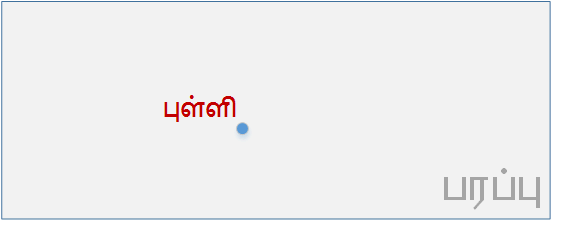
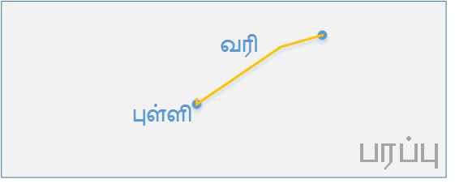

# அடிப்படை

அடிப்படையை புரிந்துகொள்வது மிகவும் முக்கியமானது, என்னெனில் நூலில் பின்வரும் பகுதிகளை புரிந்துகொள்ள உதவும்.

நீங்கள் புதியன படைப்பதற்கு, அடியாய்  இருக்கும் இந்த  `அடிப்படை`.

### புள்ளி
ஒரு பரப்பில்  உள்ள ஒரு குறிப்பிட்ட இடத்தைச் சுட்டுவது `புள்ளி`.
 
> - புள்ளி  = dot / point 
> - பரப்பு  = surface

### வரி
இரு “புள்ளி”களை இணைப்பது,  `வரி`. வரி  வரையப்படும். 
> - வரி  = line

###  அறை - வரையறை

ஒரு பொருளின் பகுதியை, அறை என்போம்.

நம் வீடுகளில் சமையலறை, படுக்கையறை என பல பகுதிகள் உண்டு.

பகுதிகள் ஒன்றோடு ஒன்று கலக்காமல், தெளிவாக பிரிக்கும் வண்ணம் ஒவ்வொரு பகுதிகளின் எல்லை என்னென்ன என்பதை விளக்கும் உரையை, 'வரையறை'  என்போம்.

## உரு / வடிவம்

ஒரு பொருளை பார்ப்பதற்குப் புலன்/உறுப்பு (கண் ) தேவை.

முதலில் நாம் உணர்வது அப்பொருளின் புறக்கோட்டைத்தான் (outline). 
அக்கோடு பொருளின் `அகம்(உள்)` எது? புறம்(`வெளி`) எது ? என்பதை வரையறுக்கும்.

வரையறுத்தல், சுற்றியுள்ள சூழிலிருந்து அறுத்து எடுப்பது போல (வடிகட்டி ) வேறுபடுத்தி வரிகள் சேர்ந்து காட்டும் காட்சி தான் `உருவம் / வடிவம்`.

> உருவம் / வடிவம் = form / shape

- புலனால் உணர்வதை / புலப்படுவதை / காண்பதை, `காட்சி` என்போம். 
- பார்க்க இயலும் தன்மையை, `பார்வை` என்போம். 
- புலப்படும் பொருளுக்குப் பின்னால்
   இருப்பது, `பின்புலம்` (அ) `பின்னணி`. 
- பின்புலத்தில் இருந்து தேறி
   வருவதால், `தோற்றம்`.

### குறி - குறியீடு

ஒரு பொருளை உணர்த்தவதற்காக (அறிவிக்க / தெரிவிக்க ) ஒரு தளத்தில் முறைப்படி வரிகளால் இடப்படும் வடிவம் தான் குறி. இடப்படுவதால் இதனைக் குறியீடு என்ன அழைக்கலாம். எ.க.

- ”+” இது கூட்டல் குறி
- ”?” இது கேள்வி குறி
ஒருவர் மற்றொருவரிடம் கூறிய சொற்தொடர் ஓர் வினா என்பதை உணர்த்த ஒரு சிறிய குறி “?” போதுமானதாய் இருக்கிறது.

> குறி= sign / code

###சின்னம்

அடிப்படையில் சின்னம் என்பது ஒரு `குறி`தான். வேறுபாடு என்னவென்றால் குறி ஒரு நேர் பொருளை குறிக்கும்.

சின்னம் இடப்படுகிற சூழலை பொறுத்து , அதன் இயல்பான பொருளில் இருந்து வேறுபடும். சின்னம் ஒரு சூழலில் (ஒரு பிரிவினர் / இடம் ) அது அடையாளமாய்த் திகழும், மற்றவருக்கு அது வெறும் குறி மட்டுமே.

சின்னம் = symbol [special meaning in specific context ]

எ.க. ஒரு நாட்டின் கொடி , அந்த நாட்டுக் குடிமக்களுக்கு ஓர் அடையாளம் / சின்னம். வேறு நாட்டவரை பொறுத்தவரையில் அது வண்ணத்துணி.

ஒருவனை மற்றவரிடத்தில் இருந்தும் / ஒரு பொருளை மற்றவையில் இருந்தும் வேற்றுமைப்படுத்தி , அவனை அடைய உதவியாய் இருப்பதே “அடையாளம்”.

தமிழ் நம் தொன்ம அடையாளம், நினைவு கொள்வீர்.
அடிப்படையில் சின்னம் என்பது ஒரு குறிதான். வேறுபாடு என்னவென்றால் குறி ஒரு நேர் பொருளை குறிக்கும்.

சின்னம் இடப்படுகிற சூழலை பொறுத்து , அதன் இயல்பான பொருளில் இருந்து வேறுபடும். சின்னம் ஒரு சூழலில் (ஒரு பிரிவினர் / இடம் ) அது அடையாளமாய்த் திகழும், மற்றவருக்கு அது வெறும் குறி மட்டுமே.

>சின்னம் = symbol [special meaning in specific context ]

எ.க. ஒரு நாட்டின் கொடி , அந்த நாட்டுக் குடிமக்களுக்கு ஓர் அடையாளம் / சின்னம். வேறு நாட்டவரை பொறுத்தவரையில் அது வண்ணத்துணி.

ஒருவனை மற்றவரிடத்தில் இருந்தும் / ஒரு பொருளை மற்றவையில் இருந்தும் வேற்றுமைப்படுத்தி , அவனை அடைய உதவியாய் இருப்பதே “அடையாளம்”.

> தமிழ் நம் தொன்ம அடையாளம், நினைவு கொள்வீர்.

